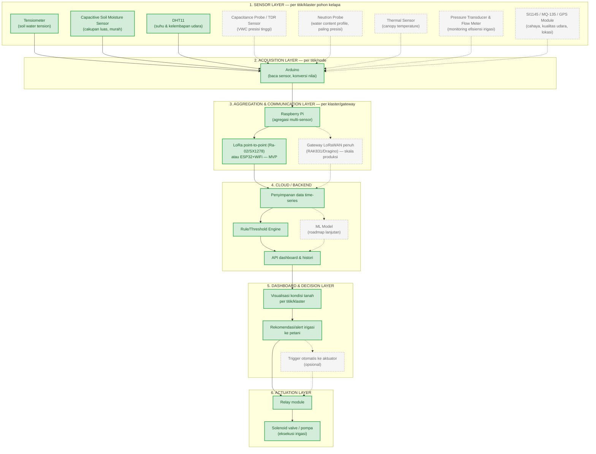

# Flowchart Skema Alat — Sistem Irigasi Presisi IoT Kebun Kelapa

Diagram Mermaid berikut memvisualisasikan skema alat dari [[schema_alat]] dan [[architecture]]: enam layer arsitektur (sensor → akuisisi → agregasi/komunikasi → cloud → dashboard/keputusan → aktuasi), dengan pembeda visual antara komponen **MVP prototype** dan **pengembangan lanjut**.

## Diagram Skema Alat

**Legenda:**
- **Kotak hijau solid** = komponen MVP prototype (fase pembuktian konsep)
- **Kotak abu-abu putus-putus** = komponen pengembangan lanjut (roadmap pasca-prototype)
- **Panah solid (`-->`)** = alur data/koneksi MVP
- **Panah putus-putus (`-.->`)** = alur data/koneksi opsional/pengembangan lanjut

## Terkait

- Detail spesifikasi & harga tiap alat: [[schema_alat]]
- Rasional pilihan komponen per layer: [[architecture]]
- Alur data & keputusan end-to-end: [[flow]]
- Cakupan alat yang benar-benar dipakai di demo: [[prototype]]
